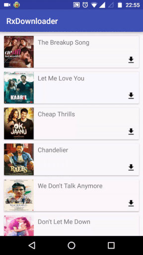

#Downloader Demo using RxJava

## Overview
This project is for downloading items(songs, images etc) in Android using RxJava2. There are, however 2 conditions which I have set for downloading.
* Only 2 items can be downloaded at a time. So even if the user clicks multiple items to download, only 2 of them will be actually downloaded at a time and the rest of the downloads will be en queued.
* The download percent is shown to the user. But only if the difference between the current percentage and the previously shown percentage is greater than 5 percent.

&nbsp; &nbsp; &nbsp; &nbsp; &nbsp; &nbsp; &nbsp; &nbsp; &nbsp; &nbsp; &nbsp; &nbsp; &nbsp; &nbsp; &nbsp; &nbsp; &nbsp; &nbsp; &nbsp; &nbsp; &nbsp; &nbsp; &nbsp; &nbsp;

## Demo
&nbsp; &nbsp; &nbsp; &nbsp; &nbsp; &nbsp; &nbsp; &nbsp; &nbsp; &nbsp; &nbsp; &nbsp; &nbsp; &nbsp; &nbsp; &nbsp; &nbsp; &nbsp; &nbsp; &nbsp; &nbsp; &nbsp; &nbsp; &nbsp; 

&nbsp; &nbsp; &nbsp; &nbsp; &nbsp; &nbsp; &nbsp; &nbsp; &nbsp; &nbsp; &nbsp; &nbsp; &nbsp; &nbsp; &nbsp; &nbsp; &nbsp; &nbsp; &nbsp; &nbsp; &nbsp; &nbsp; &nbsp; &nbsp;

There are few important RxJava classes that I have used to do this project:

* **Observable** - Emits a stream of events
* **Flowable**  - Emits a stream of events. The Flowable is created using a BackpressureStrategy like BackpressureStrategy.BUFFER or BackpressureStrategy.DROP. So, if the number of items emitted by the Flowable is greater than the number of items consumed by the subscriber, based on the BackpressureStrategy, the extra items will either be buffered or dropped.
* **Observer** - Used to observe/subscribe a stream of events. Whenever the observer is connected to the Observable, a Disposable object is received, which is further used to dispose the connection. This class has 4 methods. 
* **Subscriber** - Similar to Observer, this class is also used to observe/subscribe a stream of events and has 4 methods. But instead of Disposable object, a Subscription option is received at the time of connection, which is further used to dispose the connection or request new items from the stream.

I wrote a blog about how I used RxJava2 for achieving this. [Here](https://medium.com/@anshuljain/rxjava2-demo2-downloading-songs-in-android-2ebf91ac3a9a#.ksiae7jwc) is the post.

&nbsp; &nbsp; &nbsp; &nbsp; &nbsp; &nbsp; &nbsp; &nbsp; &nbsp; &nbsp; &nbsp; &nbsp; &nbsp; &nbsp; &nbsp; &nbsp; &nbsp; &nbsp; &nbsp; &nbsp; &nbsp; &nbsp; &nbsp; &nbsp;

**NOTE** : Since this is a demo project and not an actual project, I have kept the images and urls to be downloaded hardcoded in the client. There is no server call. Also, for every item I am saving the download status and download percent in the shared preference. In a real project, it should be ideally saved in a database.

------

Checkout my library [AppDataReader](https://github.com/Ansh1234/AppDataReader) - A library for reading Shared Preferences and Database values within the application.

